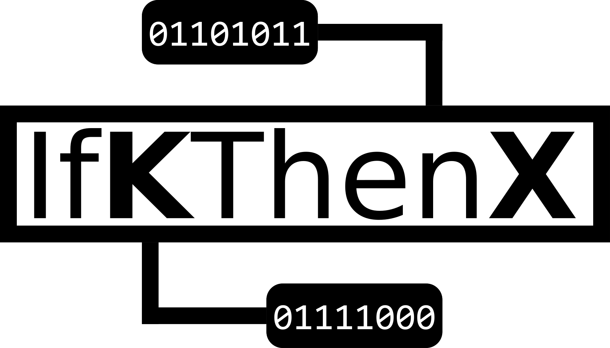

<p align="center">
    
</p>

<p align="center">
    <a href="https://docs.microsoft.com/en-us/dotnet/csharp/">
        
    </a>
    <a href="https://dotnet.microsoft.com">
        
    </a>
    
    
</p>

Welcome to **IfKThenX**, a logic layer that extends your KNX system with multi-dependent actions. It enables to define states of a bus, which are then monitored and handled with defined reactions.

---

The idea of **IfKThenX** is to respond to certain states within a KNX bus system by sending predefined telegrams.  

Let's give a very easy example: every time the light in the garage is turned on, you also want to turn on the lights in the courtyard entrance and turn off the lights in the living room. Then the state of turned-on lights in the garage is your condition *k*. If a condition is matched within the connected bus, the system will write the defined telegrams to the bus, in this case, to turn on the lights in the courtyard and off in the living room.  

A *k* can consist of as many sub-conditions as you want. Another example is that this *k* has the condition that the light in the hallway is on, and the front door is opened. The corresponding *x* could be to turn on the lights in the courtyard entrance.

## Quick start

You can operate with IfKThenX using the `IBusManager` service with the concrete type `BusManager`. Initiate a new `IBusManager` and inject your `ConnectionParameters`. A required parameter is the IP address of your KNX-IP interface as a string. That's all you need to get IfKThenX running. Now you can connect to your KNX bus system.

```CSharp
IConnectionParametes connection = new ConnectionParameters("192.0.2.1");
IBusManager bus = new BusManager(connection);
await bus.ConnectAsync();
```

IfKThenX will automatically start monitoring the bus activity.  
Finally, add one or more conditions. A condition is built of two parts, the **k** and the **x**. Every **k** can contain multiple **x**s. Under the hood, both are different states of the bus. If the state (can be a subgroup of the hole bus) within **k** is matched, the states in all corresponding **x**s are activated by sending the needed telegrams.  

Let's define a bus state for the **k**. Here we want to react if the value of the group address `1/1/63` is `true` (mostly meaning `on`). It could be that light in the garage.

```CSharp
IBusState kBusState = new BusState();
kBusState.AddOrUpdateState(new State()
{
    Address = "1/1/63",
    Value = new byte[1] { 1 },
    DataPointType = DataPointType.Dpt1
});
```

All values in IfKThenX are stored as an array of bytes. You have to provide the data point type, at least for states meant to be written to the bus. But to be consistent, you should always initiate the value. Learn more about data point types at [knx.org](https://support.knx.org/hc/en-us/articles/115001133744-Datapoint-Type).  

Now you need another bus state that represents the effect of your **x**.

```CSharp
IBusState xBusState = new BusState();
xBusState.AddOrUpdateState(new State()
{
    Address = "1/1/71",
    Value = new byte[1] { 1 },
    DataPointType = DataPointType.Dpt1
});
```

Finally, merge everything to a condition and add it to the observing bus manager.

```CSharp
IX x = new X(xBusState);
IK k = new K(kBusState, x);
bus.AddCondition(k);
Console.ReadKey();          // Keep the app running.
```

With these few lines of code, your KNX bus will behave so that if the value inside the group `1/1/63` is on/true/1, a telegram with the same value will be sent to `1/1/71`.  
You can add as many conditions as you want. Each one can have as many **x**s as you wish.  

Check out the documentation for further information. (Not ready yet)
## Dependencies
- [Microsoft .NET](https://dotnet.microsoft.com/)
- [Knx.Falcon.Sdk](https://www.nuget.org/packages/Knx.Falcon.Sdk)

## Contributions and support

IfKThenX is developed completely open, and your contributions are more than welcome.

Before you start using IfKThenX in any of your projects, please keep in mind that it’s a hobby project, and there is no guarantee for technical correctness or future releases.  

Since this is a very young project, it’s likely to have many limitations and missing features, which can only be discovered and addressed as you use it. It’s recommended that you try it out for your specific use case to ensure it supports the features you need.  

If you wish to make a change, [open a Pull Request](https://github.com/RolandBraunDev/IfKThenX/pull/new) — even if it just contains a draft of the changes you’re planning or a test that reproduces an issue — and we can discuss it further from there.

I hope you’ll enjoy using IfKThenX!